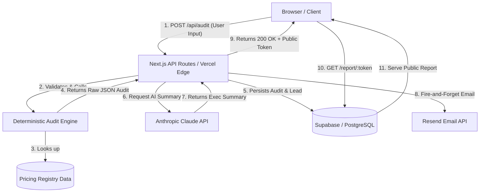

# Architecture — SpendPilot AI

## System Architecture

## Full Data Flow

1. **User Input:** The user fills out the audit form on `/audit`, specifying their company size, use case, and their current SaaS stack (tools, plans, seats, monthly spend).
2. **Audit Engine:** The form POSTs to `/api/audit`. The input is validated using Zod. The `runAudit()` function processes the tools against the `pricingConfig.ts` registry. Deterministic rules execute to flag overspending, redundant tools, and incorrect plan tiers.
3. **AI Summary:** If the audit is complex, `/api/summary` sends the calculated metrics to Anthropic's Claude Haiku model using a structured prompt to generate a 3-paragraph executive summary and priority action items.
4. **Database (DB):** The raw JSON results, user metadata, and AI summaries are persisted to Supabase via the `audits` and `leads` tables. A unique `public_token` is generated.
5. **Email Delivery:** Resend is triggered asynchronously to email the user a link to their public report.
6. **Public Report:** The frontend redirects the user to `/report/:token`, which fetches the persisted audit from Supabase and renders the interactive dashboard.

## Why this stack was chosen

- **Next.js 16 (App Router):** First-class support for React Server Components reduces client bundle size. API Routes allow us to build a full-stack app in a single repository, perfect for rapid iteration.
- **Supabase:** Offers out-of-the-box PostgreSQL, connection pooling, and Row Level Security (RLS) policies. This avoids the overhead of managing a dedicated database infrastructure.
- **Anthropic Claude Haiku:** Chosen over GPT-4o for its exceptional speed and cost-effectiveness when dealing with structured JSON parsing and short-form summary generation.
- **Tailwind CSS v4:** The new CSS-first `@theme` API removes configuration overhead and makes implementing a consistent design system (glassmorphism, dark mode) trivial.

## Scaling Plan (Handling 10,000 Audits/Day)

At 10,000 audits per day (~7 audits/minute), the primary bottlenecks are database writes and Anthropic rate limits.
1. **Edge Caching:** The static Pricing Registry is bundled with the edge functions, meaning 0 latency for rule execution.
2. **Database Pooling:** We will utilize Supabase's built-in PgBouncer connection pooling to ensure the DB does not crash under concurrent writes.
3. **Queueing System:** Move the Anthropic AI Summary generation and Resend email dispatch to a background queue (e.g., Inngest or Upstash Kafka) rather than handling them within the synchronous `/api/audit` request lifecycle.
4. **Read Replicas:** If public report reads surge, we will enable Supabase read replicas and implement aggressive `Cache-Control` headers for the `/report/:token` route.

## Performance Considerations

- **Strict Validation:** Zod ensures no malformed data reaches the rule engine, preventing expensive regex or parsing crashes.
- **Synchronous Engine:** The audit engine is 100% synchronous and deterministic. It runs in <5ms.
- **Optimistic UI:** The client uses `sessionStorage` to instantly render the report dashboard while the server finishes saving the data to Supabase and generating the AI summary.

## Security Considerations

- **Row Level Security (RLS):** Supabase RLS is configured so public users can only SELECT reports via the highly entropic `public_token` UUID. They cannot list all reports.
- **API Key Protection:** Anthropic, Supabase Service Role, and Resend API keys are strictly stored in server-side environment variables and never exposed to the client bundle.
- **Rate Limiting:** Vercel KV rate limiting will be applied to the `/api/audit` endpoint to prevent malicious actors from spamming the system and racking up Anthropic API costs.
